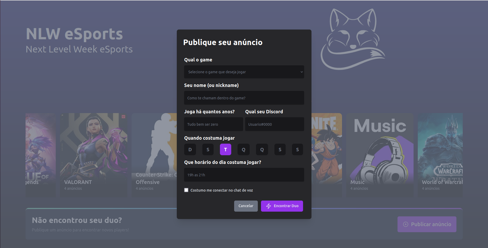

# eSports_NLW
Nextjs Layout Básico da NLW eSports

## Como começar

Versão node >= 12.22.0.<br />
Primeiro, instale as dependências

```bash
yarn
# or
npm install
```

- Depois copie o .env.example para um novo arquivo .env.local
- Adicione as chaves do app da Twitch

Depois rode o servidor
```bash
npm run dev
# or
yarn dev
```

Layout simples em Nextjs com Tailwind, apenas para aprendizagem.<br />
Não cuidei muito a parte de validações de api e segurança. Apenas layout



